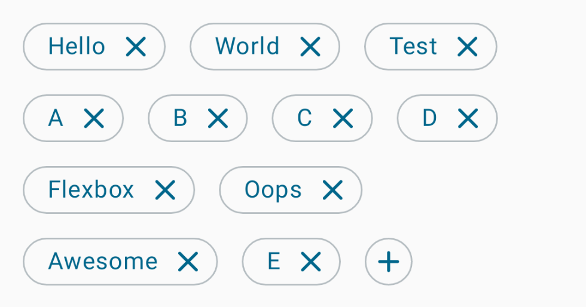
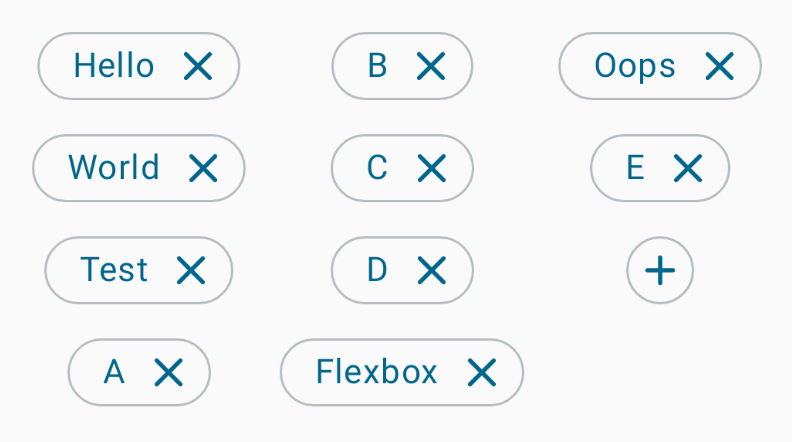
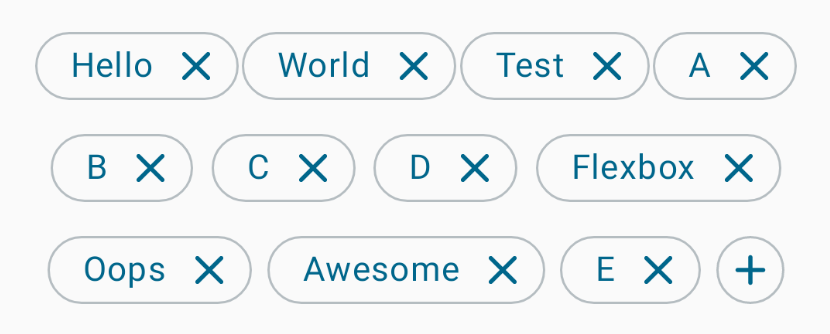
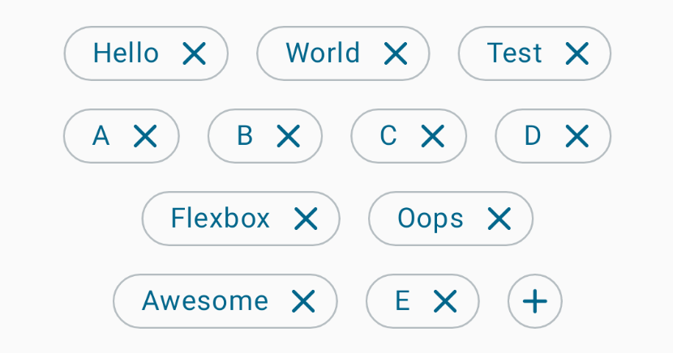
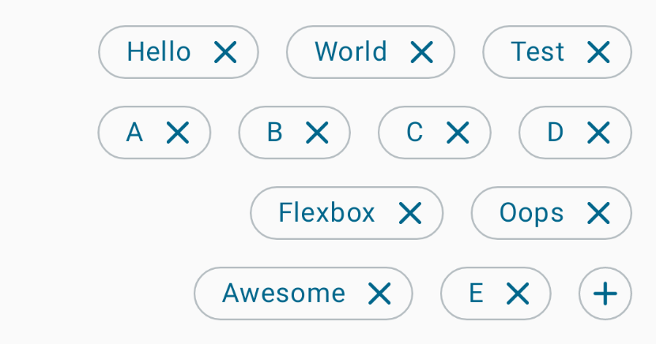
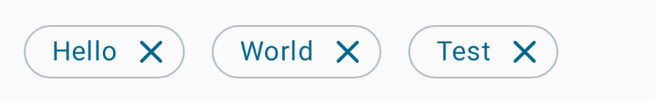
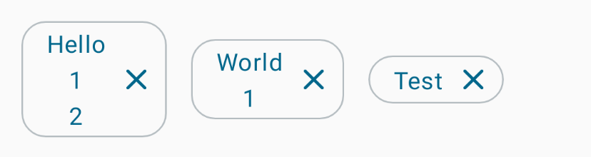
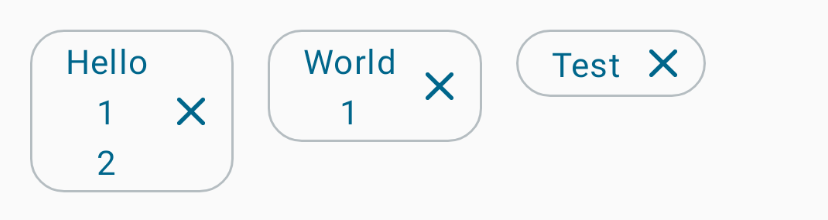

# LazyFlowLayout
[](http://developer.android.com/index.html)
[](https://android-arsenal.com/api?level=21)
[](https://search.maven.org/artifact/io.github.aghajari/Flexbox-Compose/1.0.0/aar)
[](https://gitter.im/Aghajari/community?utm_source=badge&utm_medium=badge&utm_campaign=pr-badge&utm_content=badge)

 A [Jetpack Compose](https://developer.android.com/jetpack/compose) [layout](https://developer.android.com/jetpack/compose/layouts) that places its children in a way that [CSS Flexible Box Layout](https://developer.mozilla.org/en-US/docs/Web/CSS/CSS_flexible_box_layout) Module does.

 <br>


## Table of Contents  
- [Installation](#installation)  
- [Usage](#usage)
  - [LazyFlowRow](#flexbox-row)
  - [LazyFlowColumn](#flexbox-column)
  - [Arrangements](#arrangements)
  - [MaxLines](#maxlines)
  - [Item Inline Alignment](#item-inline-alignment)
  - [Animation](#flexbox-animation)
  - [Key Identifier](#key-identifier)
- [Author](#author)
- [License](#license)

  
## Installation

**LazyFlowLayout** is available in the `mavenCentral()`, so you just need to add it as a dependency (Module gradle)

```gradle
implementation("io.github.aghajari:Flexbox-Compose:1.0.0")
```

## Usage

### lazyFlowRow



```kotlin
LazyFlowRow(
  horizontalArrangement = Arrangement.spacedBy(16.dp),
  verticalArrangement = Arrangement.spacedBy(16.dp),
  modifier = modifier
    .verticalScroll(rememberScrollState())
    .padding(16.dp)
) {
    // Add items
    items(list) {
        RemovableItem(it)
    }
    item {
        AddIcon()
    }
}
```

### LazyFlowColumn



```kotlin
LazyFlowColumn(
  horizontalArrangement = Arrangement.spacedBy(16.dp),
  verticalArrangement = Arrangement.spacedBy(16.dp),
  modifier = modifier
    .verticalScroll(rememberScrollState())
    .padding(16.dp)
) {
    // Add items
}
```

### Arrangements

 You can customize the arrangement of both axis in **LazyFlowLayout**.
 
 * `LazyFlowRow`: **horizontalArrangement** defines the arrangement of Placeables on the line and **verticalArrangement** defines the arrangement of lines.
 * `LazyFlowColumn`: **verticalArrangement** defines the arrangement of Placeables on the line and **horizontalArrangement** defines the arrangement of lines.

Examples:

- **SpaceEvenly**



```kotlin
LazyFlowRow(
    horizontalArrangement = Arrangement.SpaceEvenly,
    verticalArrangement = Arrangement.spacedBy(16.dp),
) {
    // Add items
}
```

- **Center**



```kotlin
LazyFlowRow(
    horizontalArrangement =
        Arrangement.spacedBy(16.dp, Alignment.CenterHorizontally),
    verticalArrangement = Arrangement.spacedBy(16.dp),
) {
    // Add items
}
```

- **End**



```kotlin
LazyFlowRow(
    horizontalArrangement =
        Arrangement.spacedBy(16.dp, Alignment.End),
    verticalArrangement = Arrangement.spacedBy(16.dp),
) {
    // Add items
}
```

### MaxLines

You can set an optional maximum number of lines.

- **SingleLine**



```kotlin
LazyFlowRow(
    maxLines = 1,
    ...
) {
    // Add items
}
```

### Item Inline Alignment

You can set the default alignment of Placeables inside a FlexboxLine.

- **Center**



```kotlin
LazyFlowRow(
    maxLines = 1,
    itemInlineAlignment = Alignment.Center,
) {
    // Add items
}
```

- **Top**



```kotlin
LazyFlowRow(
    maxLines = 1,
    itemInlineAlignment = Alignment.TopCenter,
) {
    // Add items
}
```

### Animation

Customize the animation of item movements. A **spring** spec will be used for the animation by default.

You can pass `null` to disable the animation.

```kotlin
val myAnimation = object : LazyFlowLayoutAnimation {
    override val visibilityThreshold = 0.01f
    override val animationSpec = tween<Float>(
        durationMillis = 600,
        easing = FastOutSlowInEasing
    )
}

LazyFlowRow(
    animation = myAnimation,
) {
    // Add items
}
```

### Key Identifier

You can set a factory of stable and unique keys representing the item. Using the same key for multiple items in the list is not allowed.

If you have fixed amount you can use enums as keys, or if you have a list of items maybe an index in the list or some other unique key can work.

If `null` is passed the position in the list will represent the key.

```kotlin
Flexbox(...) {
    items(
        list,
        key = { list[it].key }
    ) {
        Content(it)
    }

    item(MY_KEY) {
        SingleItem()
    }
}
```

## Author
Amir Hossein Aghajari, Javad Jafari

License
=======

    Copyright 2023 Amir Hossein Aghajari
    Licensed under the Apache License, Version 2.0 (the "License");
    you may not use this file except in compliance with the License.
    You may obtain a copy of the License at

       http://www.apache.org/licenses/LICENSE-2.0

    Unless required by applicable law or agreed to in writing, software
    distributed under the License is distributed on an "AS IS" BASIS,
    WITHOUT WARRANTIES OR CONDITIONS OF ANY KIND, either express or implied.
    See the License for the specific language governing permissions and
    limitations under the License.

<br>
<div align="center">
  
  <br><a>Amir Hossein Aghajari</a> • <a href="mailto:amirhossein.aghajari.82@gmail.com">Email</a> • <a href="https://github.com/Aghajari">GitHub</a>
</div>
